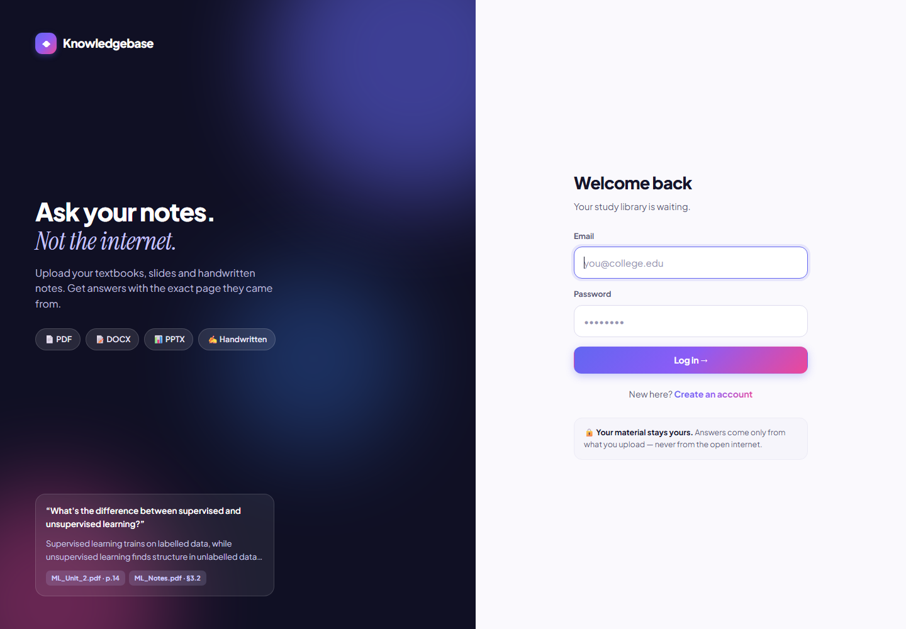
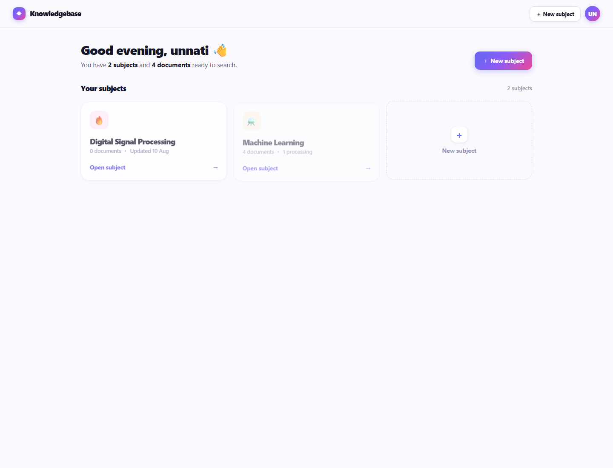
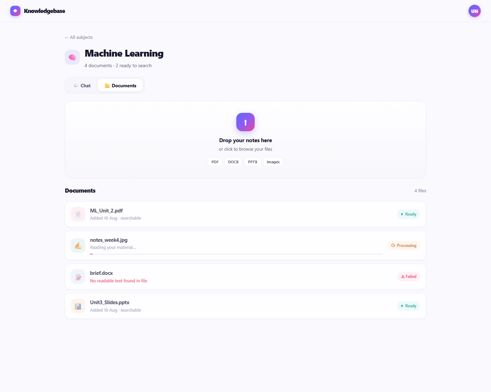
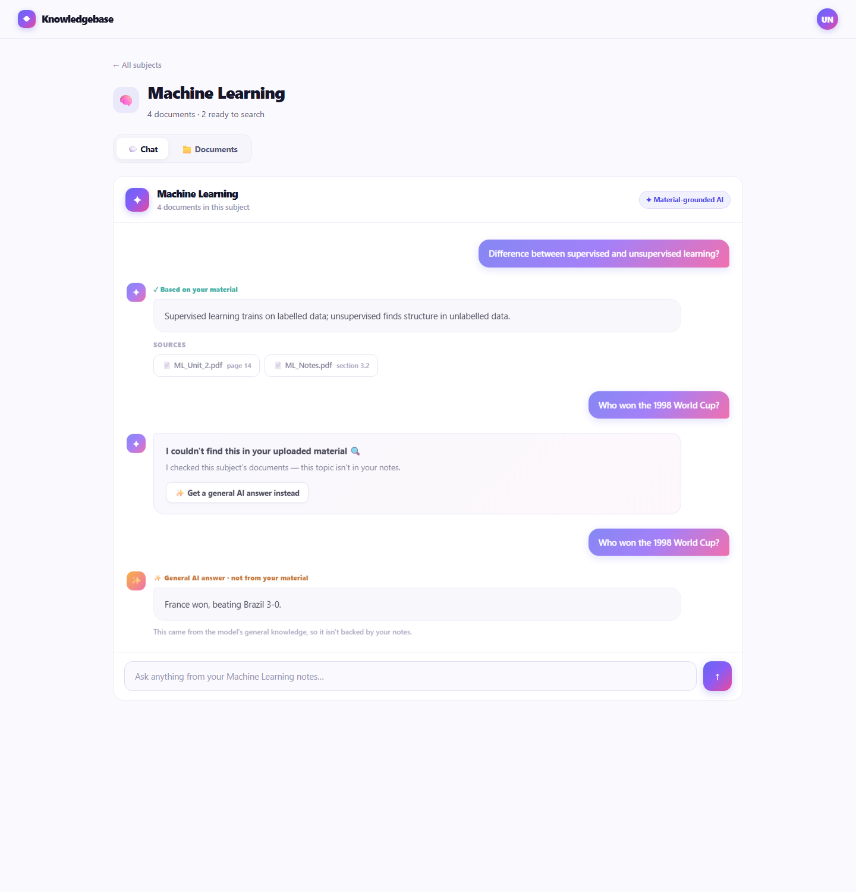
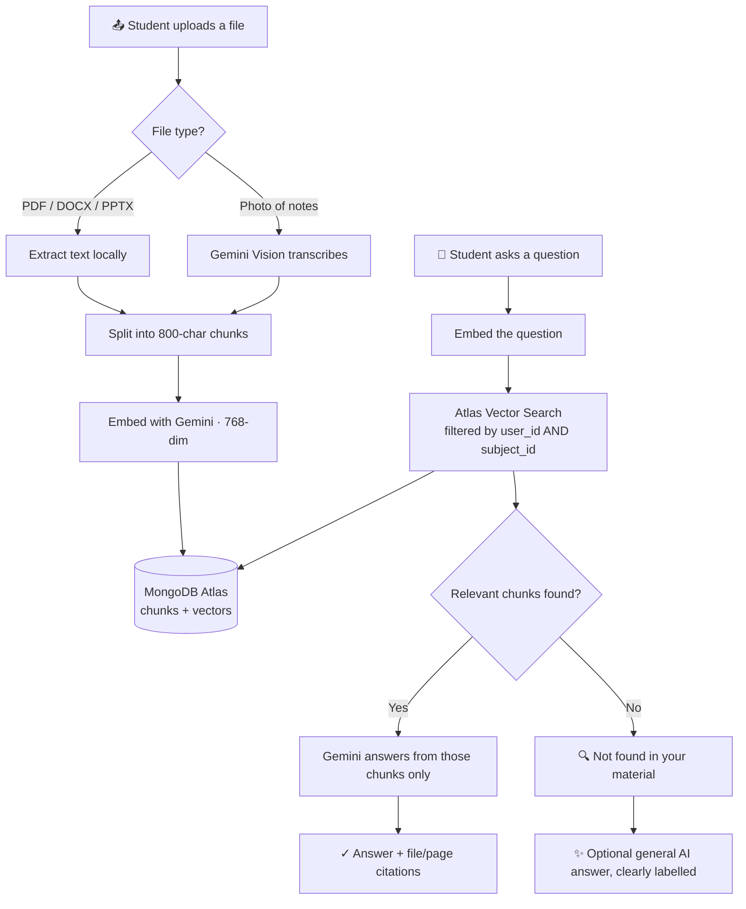
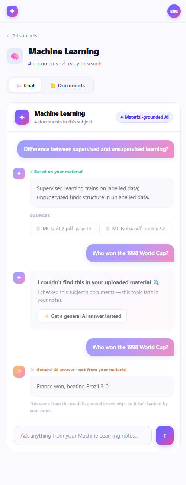

<div align="center">

# ◆ Exam Partner

### Ask your notes. Not the internet.

**An AI study assistant that answers *only* from the material you upload — with the exact page it came from.**

[](https://www.python.org/)
[](https://fastapi.tiangolo.com/)
[](https://htmx.org/)
[](https://www.mongodb.com/atlas)
[](https://ai.google.dev/)
[](#-testing)



</div>

---

## 🎯 The problem

A semester is 3–4 months long and covers about five subjects. Teachers expect answers written from
the specific textbooks they recommended — but realistically, no student has time to read every book,
make notes for all of them, and revise.

So most students fall back on ChatGPT. The catch: it answers from the internet, not from the
material the teacher actually assigned. The answer sounds right and still misses the point.

**Exam Partner flips that around.** Upload your own textbooks, slides and handwritten notes.
Ask a question. Every answer is drawn *only* from your material, and cites the file and page it
came from. If something genuinely isn't in your notes, it says so honestly instead of inventing
an answer.

---

## ✨ Features

|  | |
|---|---|
| 📚 **Subject libraries** | Separate spaces for Machine Learning, Thermodynamics, DSP… material never crosses between them |
| 📄 **Upload anything** | PDF, DOCX, PPTX, and photos of handwritten notes |
| ✍️ **Handwriting OCR** | Gemini Vision reads photographed notes and makes them searchable |
| ⚡ **Background processing** | Uploads never block — live status updates via HTMX polling |
| 🔍 **Grounded answers** | Every answer cites `filename · page` so you can verify it |
| 🙅 **Honest "not found"** | No hallucinating. It tells you when a topic isn't in your notes |
| ✨ **Opt-in general AI** | Want a general answer anyway? One click — clearly labelled as *not* from your material |
| 💬 **Per-subject history** | Every conversation is saved, tagged grounded or general |
| 🔒 **Private by default** | Retrieval is filtered by user *and* subject at the query level |

---

## 📸 Screenshots

<table>
<tr>
<td width="50%"><br><em align="center">Dashboard — your subject libraries</em></td>
<td width="50%"><br><em>Documents — upload and live indexing status</em></td>
</tr>
<tr>
<td colspan="2"><br><em>Chat — grounded answers with sources, the honest not-found state, and a clearly-labelled general AI answer</em></td>
</tr>
</table>

---

## 🧠 How it works



### Retrieval settings

| Setting | Value |
|---|---|
| Chunk size | 800 characters, 100 overlap |
| Embedding dimensions | 768 |
| Similarity | Cosine |
| Chunks retrieved (top-k) | 5 |
| Query filter | `user_id` **and** `subject_id` |

> **The property that matters most:** every vector search filters on both the user and the
> subject *inside the query itself* — not in the UI. One student can never retrieve another's
> material, and a Physics question can never pull from Chemistry notes.

---

## 🛠 Tech stack

| Layer | Technology | Why |
|---|---|---|
| **Backend** | FastAPI + Uvicorn | Async-capable Python with clean dependency injection |
| **Frontend** | Jinja2 + HTMX | Server-rendered — no JavaScript build step at all |
| **Database** | MongoDB Atlas | One store for users, subjects, documents, chat **and** vectors |
| **Vector search** | Atlas Vector Search | No separate vector database to run |
| **AI** | Google Gemini | One API for chat, embeddings **and** handwriting OCR |
| **Orchestration** | LangChain | Text splitting, vector store adapter, model clients |
| **Auth** | passlib + bcrypt | Hashed passwords, signed session cookies |
| **Extraction** | PyMuPDF · python-docx · python-pptx | Local parsing — no API cost for typed files |
| **Testing** | pytest + mongomock | Full suite runs offline, no credentials needed |

**Models in use:** `gemini-flash-latest` (answers + vision OCR) · `gemini-embedding-001` (768-dim embeddings)

---

## 🚀 Quick start

### 1. Clone and install

```bash
git clone https://github.com/unnati-bh1204/Exam-Partner.git
cd Exam-Partner

python -m venv .venv
.venv/Scripts/pip install -r requirements.txt      # Windows
# source .venv/bin/activate && pip install -r requirements.txt   # macOS/Linux
```

### 2. Configure

Copy `.env.example` to `.env` and fill it in:

```env
MONGODB_URI=mongodb://localhost:27017/?directConnection=true
MONGODB_DB_NAME=exam_partner
GEMINI_API_KEY=your-gemini-api-key
SESSION_SECRET=any-long-random-string
```

- **Gemini API key** — get one free at [aistudio.google.com/apikey](https://aistudio.google.com/apikey)
- **Database** — pick one of the two options below

<details open>
<summary><b>Option A — Local MongoDB via Docker (recommended)</b></summary>

<br>

Runs entirely on your machine, so nothing pauses or rate-limits you.

> ⚠️ Use the **`mongodb-atlas-local`** image, not plain `mongo`. MongoDB Community Edition has
> **no vector search**, so chat would break — this image bundles the search engine that
> `$vectorSearch` needs.

```bash
docker run -d --name exam-partner-mongo -p 27017:27017 \
  --restart unless-stopped mongodb/mongodb-atlas-local:latest
```

Then use `MONGODB_URI=mongodb://localhost:27017/?directConnection=true`.

Start it again after a reboot with `docker start exam-partner-mongo`.

</details>

<details>
<summary><b>Option B — MongoDB Atlas (cloud)</b></summary>

<br>

Create a free M0 cluster at [cloud.mongodb.com](https://cloud.mongodb.com) and add your IP under
*Network Access*, then use:

```env
MONGODB_URI=mongodb+srv://<user>:<password>@<cluster>.mongodb.net/?retryWrites=true&w=majority
```

Note that free shared clusters pause when idle and can be briefly unreachable — the app handles
this with a readable outage page rather than an error.

</details>

### 3. Create the vector index (one time)

```bash
PYTHONPATH=. .venv/Scripts/python scripts/create_vector_index.py
```

### 4. Run

```bash
.venv/Scripts/uvicorn app.main:app --port 8000 --reload
```

Open **http://localhost:8000** → sign up → create a subject → upload your notes → start asking.

---

## 🧪 Testing

```bash
.venv/Scripts/python -m pytest -q      # 58 tests
```

Built test-first throughout — every feature started with a failing test. The suite runs **entirely
offline**: `mongomock` stands in for Atlas and Gemini calls are mocked, so it needs no credentials
and no network.

- **Unit** — text extraction, chunking, retry logic, response parsing
- **Integration** — auth flows, subject CRUD, upload pipeline, chat endpoints
- **Isolation** — explicit tests that one user cannot read another's data
- **Failure modes** — database outages and AI quota limits render readable pages, not stack traces

---

## 📁 Project structure

```
app/
├── main.py            FastAPI app, route mounting, error handlers
├── config.py          Environment settings (pydantic-settings)
├── db.py              MongoDB client + collection helpers
├── auth.py            Signup / login / logout, password hashing
├── subjects.py        Subject CRUD + dashboard summary counts
├── documents.py       Upload + background processing pipeline
├── chat.py            Ask / general-answer endpoints, history
├── extraction.py      PDF, DOCX, PPTX parsing + Gemini vision OCR
├── chunking.py        Text splitting with unique chunk ids
├── embeddings.py      Gemini embedding client (768-dim)
├── vectorstore.py     Atlas Vector Search store + filtered search
├── rag_chain.py       Grounded prompt, not-found detection, general mode
├── retry.py           Retry-with-backoff for external services
├── llm_response.py    Normalises Gemini's response shapes
├── templates/         Jinja2 pages + HTMX partials
└── static/            Stylesheet and self-hosted fonts

scripts/create_vector_index.py    One-time Atlas index setup
tests/                            17 modules · 58 tests
docs/superpowers/                 Design specs and implementation plans
```

---

## 🎨 Design



Built for students — modern and energetic without looking like an enterprise dashboard.

- **Palette** — soft off-white canvas, deep navy ink, an indigo → violet → pink gradient as the single accent
- **Type** — Plus Jakarta Sans with Instrument Serif italic accents; both self-hosted, so there's no external font dependency
- **Semantic colour** — reserved strictly for document status, so it never competes with the brand
- **Motion** — hover lifts, staggered card entrances, an indexing shimmer; all disabled under `prefers-reduced-motion`
- **Accessible** — semantic HTML, labelled fields, visible focus rings, keyboard-reachable menus
- **Responsive** — works on laptop, tablet and phone

<br clear="right">

---

## 🌿 Branches

| Branch | Contains |
|---|---|
| `main` | The complete, current project |
| `student-ui` | The student-focused UI redesign |
| `react-frontend` | An alternative React SPA + JSON API layer (explored, then parked in favour of the simpler stack) |

---

## ⚠️ Known limits

- **Gemini free tier** caps daily requests — the app shows a clear "daily limit reached" message rather than an error
- **Atlas free tier** clusters pause when idle and can be briefly unreachable — handled with a readable outage page
- **Handwriting accuracy** depends on how legible the photo is
- **Local only** — no deployment configured yet
- **Not yet built** — reranking after vector search, subject rename in the UI, password reset

---

<div align="center">

**Built for students who'd rather ask their own notes.**

</div>
